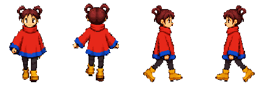
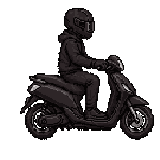
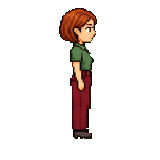

# Build Character Walking Animation Pipeline

Want to automate the process of making 2D pixel-art character walking animations? You've come to the right place.

## The result



This is the result I want from the pipeline: one character that can walk cleanly in every direction and loop without a visible hitch.

## The workflow

1. Codex generates a South-facing anchor for you to approve.
2. Codex generates the remaining canonical directions for you to review together.
3. Codex gives you the exact anchor and prompt. You generate the walking video with a tool of your choice and return it.
4. Codex reviews the full video, proposes a walking loop, and shows you the result for approval.
5. (Optional) Codex creates a per-frame pixel-snap comparison. You choose whether to keep the original or snapped frames.
6. Codex exports the runtime frames, spritesheet, previews, and QA results for your final approval.

## In the game

Walking is the focus of this repository, but it is only one part of how I use the characters in *Mine Now*. These clips show the wider animation work around the game; the current repository does not generate these two actions.

| Riding snatch | Finding the missing phone |
| --- | --- |
|  |  |

You can [play *Mine Now* on itch.io](https://jinwang.itch.io/mine-now) or [read the PDF for a detailed explanation of how the workflow works](https://drive.google.com/file/d/1Lz15sl7uysUfuICtlAp-vgcVwLhwSy9b/view?usp=sharing).

## Requirements

- Python 3.10 or newer
- Packages listed in `requirements.txt`
- An image-generation capability available to Codex for every still-image anchor
- A user-selected image-to-video tool for walking clips

## Install the skills

Clone the repository and install its Python dependencies:

```bash
git clone https://github.com/chihyinwang/build-character-walking-animation-pipeline.git
cd build-character-walking-animation-pipeline
python3 -m venv .venv
source .venv/bin/activate
python3 -m pip install -r requirements.txt
```

Then ask Codex:

```text
Install the skills from this cloned skill-only plugin folder for my user account.
```

After installation, start with:

```text
$build-character-walking-animation-pipeline
```

The default character location is `~/Desktop/Sprites/npc-01`. Pass another character root when needed.

## Q&A

### How can I customize this repository?

I built this repository as a starting point rather than a locked tool. There are several useful directions you can take it:

- Add definitions for more animation types, such as jumping, talking, greeting, or reacting. Each action can have its own named moments, legal phase order, and visual checks.
- Add stronger character-style definitions for body proportions, silhouettes, palettes, clothing, or a complete roster style.
- Change the character-root name or location. If you also change the internal folder layout, update the scripts, skill instructions, artifact-layout reference, and tests together.
- Change the runtime output specification, including cell size, FPS, sheet columns, character height, ground anchor, chroma key, and chroma tolerance.
- Change which directions are required and whether a direction should be generated independently or mirrored from another direction.
- Adjust motion-validation thresholds, phase definitions, and approval checkpoints to match the quality bar of your own project.
- Add an engine-specific exporter or importer for Unity, Godot, Unreal, or your own runtime format. The bundled exporter intentionally stays engine-neutral.

### Why is pixel snapping every frame optional?

I have found that pixel snap can sometimes make small character details disappear or change. For me, it is a trade-off: sometimes I would rather keep those details, even if that means a few pixels are not perfectly snapped. I suspect the reason is that the pixel-snap algorithm could still be improved, but I have not worked on that part yet.

### Why do I generate the video myself instead of letting the AI operate a platform like Grok?

Video generation often goes wrong in ways that are immediately obvious when you watch the result: the character drifts, the walk breaks, or the motion just does not feel right. For me, the fastest feedback loop is to operate the video tool myself, see the problem as soon as it appears, adjust the prompt, and try again.

### What if the generated characters do not have a consistent style?

If you are building a roster, I recommend generating a large batch of South-facing NPC anchors in one session. Ask the AI to keep the body proportions consistent across every character. This gives you a pool of South anchors that already belong to the same visual family before you continue the pipeline character by character.

### Which video-generation platforms do I recommend?

I currently use Grok, but there are many other platforms worth trying. These tools change very quickly, so I do not think there is one permanent best choice. I switch between them from time to time as the available models improve.

### Why does this pipeline focus on walking animation?

Walking is one of the most repetitive animations and almost every moving character needs it. My goal is to make that repeated production work as convenient, fast, and precise as possible.

### What if I want to make an animation other than walking?

There are two routes.

The first is to generate an exceptionally smooth, evenly timed video. If the source motion is genuinely clean, selecting a frame every few frames can be enough to recover the animation. You still need to inspect the result and its loop rather than assume uniform sampling worked.

The second is to break the action into named moments. For a jump, for example, you might define ten moments that together form the complete sequence. Once the AI understands those moments and their order, it can label the video and select one keyframe for each moment.

### What matters most when selecting keyframes?

The quality of the source video. For a walk, if the video contains even one complete sequence with clean motion, you can usually turn that sequence into a usable loop. Keyframe selection cannot repair a walk that is broken everywhere in the source.

### What matters most during review?

Ask the AI to make a GIF. That is usually the fastest way to review the actual result instead of reasoning about a folder of still frames. When something looks wrong, identify where the problem starts and tell the AI which frame or transition needs another look.

## Dependency boundary

- All pipeline logic lives under `scripts/`; no script or reference from another locally installed Codex skill is required.
- External requirements are limited to the declared Python packages, Codex's native image-generation and file-inspection tools, and the video returned by the user.
- Generated media and runtime assets live in the selected character root outside this repository. Manifests use relative paths and hash their approval inputs.

## Skill and code map

| Skill | Human checkpoint | Bundled code |
| --- | --- | --- |
| `build-character-walking-animation-pipeline` | Routes to exactly one next step | `pipeline_status.py`, `character_identity.py` |
| `build-character-anchor-set` | Approve South, then approve all four directions | `make_pixel_guide.py`, `pixel_snap.py`, `normalize_directional_anchor.py`, `mirror_image.py`, `build_anchor_review.py`, `record_approval.py` |
| `prepare-character-walk-video` | User receives exact image and prompt; returns a video; approves or rejects the full-timeline review | `build_walk_request.py`, `ingest_walk_video.py`, `extract_video_frames.py`, `walk_video_review.py`, `record_video_selection.py` |
| `select-character-walk-keyframes` | Approve the proposed fixed-FPS loop and validation evidence | `keyframe_pipeline.py`, `validate_phase_map.py`, `validate_motion_continuity.py`, `animation_media.py` |
| `pixel-snap-character-walk` | Choose original by default, or approve/reject a snapped comparison | `snap_selected_frames.py`, `build_snap_comparison.py`, `record_frame_source.py`, `pixel_snap.py` |
| `export-character-walk-runtime` | Approve the final runtime previews and computed QA | `runtime_export.py`, `mirror_animation.py`, `check_animation_stability.py`, `record_approval.py` |
